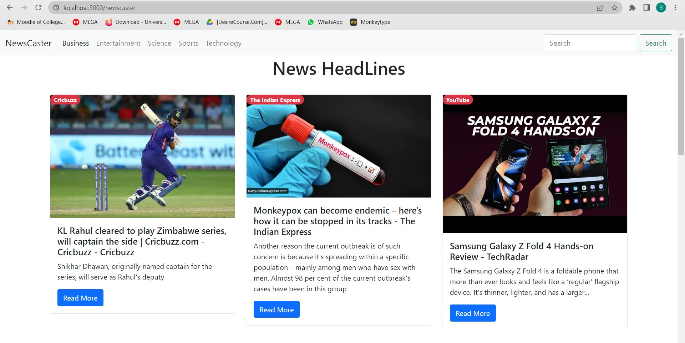

# Newscaster
News app which made using React.

</br>

# About Project
- Udates user with the current world.
- Provide various categories such as Business,Sports,Science,etc.
- Can search for specific keyword.
- Uses BootStrap for responsiveness.
</br>

### Installation
* To run the project on your Localhost :
    * Clone the repository : 
    ```sh 
    https://github.com/Siddhesh4501/Newscaster.git
    ```
    * At the project root run : 
    ```sh 
    npm run dev
    ```

### Working Project 

## General Purpose


## Sports


## Science


## Specifc Keyword

